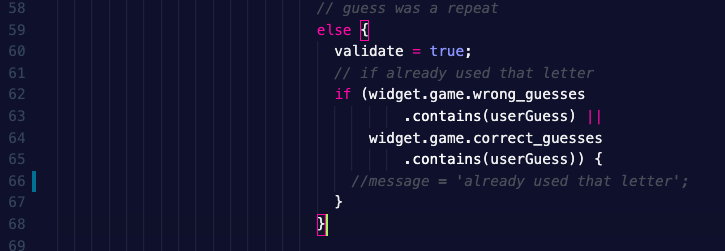
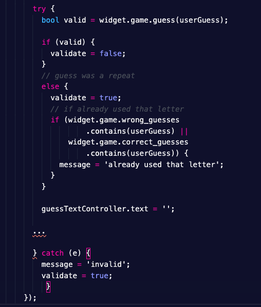
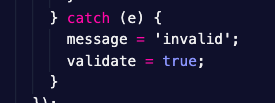

## Clean-Up Mission: Stark's Review

Oh no. At GameRiot, everyone is trusted to do their part. But that doesn't mean that everyone can escape review. 

Review of code is normally done at the time new code is checked-in. Since the project was already started and we are dealing with 'legacy' code, Edgar has only been checking your new additions.

Edgar made a comment to Mr. Stark about the quality of some of the existing code base and Mr. Stark stepped in and reviewed your repository. Ugh oh. Scary boss. However, as engineers we should seek to improve the codebase.

He doesn't care whose fault it is, he just wants continuous improvement.


**First thing is first:** Mr. Stark thinks the design is hideous and hopes that this is just a prototype --- but that's a conversation for another day. He knows how this goes and that when dealing with legacy code we should try to get everything up to standards first before trying to make improvements.


**Second thing:** upon investigating `lib/screens/gamescreen.dart`, he noticed some things that seemed redundant and that there was probably a good opportunity to refactor some code. In order to do this we need the code that is to be refactored to be covered by testing. One of Edgar's concerns he addressed to Mr. Stark was the possibility that some tests were incorrect. Upon further inspection, they found this to be true. Because the tests are not correct, we can't improve the code that is supposed to be covered by that test. Red, green, refactor. In Test-Driven Development, which GameRiot advocates when possible, the idea is to write a failing test, then pass the test, then improve the code. In this case, we are passing the test only because the test is wrong and we should not proceed to refactor.


**Third thing: ** Mr. Stark noticed that there was not adequate test coverage. There are no integration tests that check for invalid input. 


*How does Code Review at check-in prevent this from happening?*

Well if all code that was written was checked-in to feature branches and reviewed by another developer, the other developer could have caught that the tests provided weren't actually working. The code reviewer also could have caught that there was insufficient test coverage. The code reviewer probably could have recommended some refactoring.


# Homework

## Step 0 - Make a feature branch

Create a branch but **prefix your branch name with your initials**. For me, Eric Martinez I would use:

```
git checkout -b em-clean-up
```


## Step 1 - Verify the Tests are Broken

*The issue here is that when someone takes a repeated guess, we are supposed to display an error message as a decoration to the TextField (this does happen correctly). However, the tests that check this are not properly implemented.*


1. Comment out the following line of code (line 66 in my code):

   

2. Run the Integration Tests again: `flutter drive --target=test_driver/app.dart`
3. Verify that the code still passes the tests even though we are not showing the error message anymore.


## Step 2 - Fix the tests

1. Replace all the broken `expect` checks:
   1. Find all occurrences of: `expect(find.text('already used that letter'), isNotNull);`
   2. Replace with: `await driver.waitFor(find.text("already used that letter"));`
2. Replace incorrect text:
   1. Line 175: Should read `test('Scenario: guess incorrect letter that I have already tried',`
   2. Line 196: Should read ` test('Scenario: guess same incorrect letter that I have already tried more times',`


## Step 3 - Validate

1. With the line from Step 1 commented out, tests should now fail
2. When it is not commented out, tests should pass


## Step 4 - Refactor (60 points)

Take a look at this excerpt:




Mr. Stark thinks that this code can be clean up. The way `try/catch` works is that when you try the risky code, if it throws an exception then no further code is execute and then you immediately go to the `catch` block. The main issue comes with the fact that we know the `guess(letter)` function returns **false** when a letter is repeated. Some of this other logic seems unnecessary. If it returns **false**, and we didn't get diverted to the `catch` block then we know that we already have used that letter. No further if statements are necessary.


Also this part seems weird:



If it is invalid then it is valid? Maybe this variable is not named correctly or intuitively.


## Step 5: Missings tests to check for invalid input (20 points)

Mr. Stark also noticed that the tests to check for invalid input are missing. Using the other tests as examples, add in the correct tests to make sure invalid input is not allowed.

To do this, first check in the simulator what happens when you put in invalid input.

Then write tests that make sure this behavior happens when given invalid input in a test.


## Step 6: Publish Branch / Code Review / Merge / Delete

1. Push your changes to Github. (Use VSCode or Terminal)

   ```
   git push origin em-clean-up
   ```

2. Submit a pull request. 

3. CodeMagic will tell you if you failed any tests. If you pass all the tests, ask Edgar Gutierrez in Discord for a Code Review.

4. Once accepted, checkout the master branch.

   ```
   git checkout master
   ```

5. Delete your remote feature branch.

   ```
   git push origin --delete em-restore-working-version
   ```

6. Delete your local feature branch.

   ```
   git branch --delete em-restore-working-version
   ```

7. Pull the latest changes into your local master branch.

